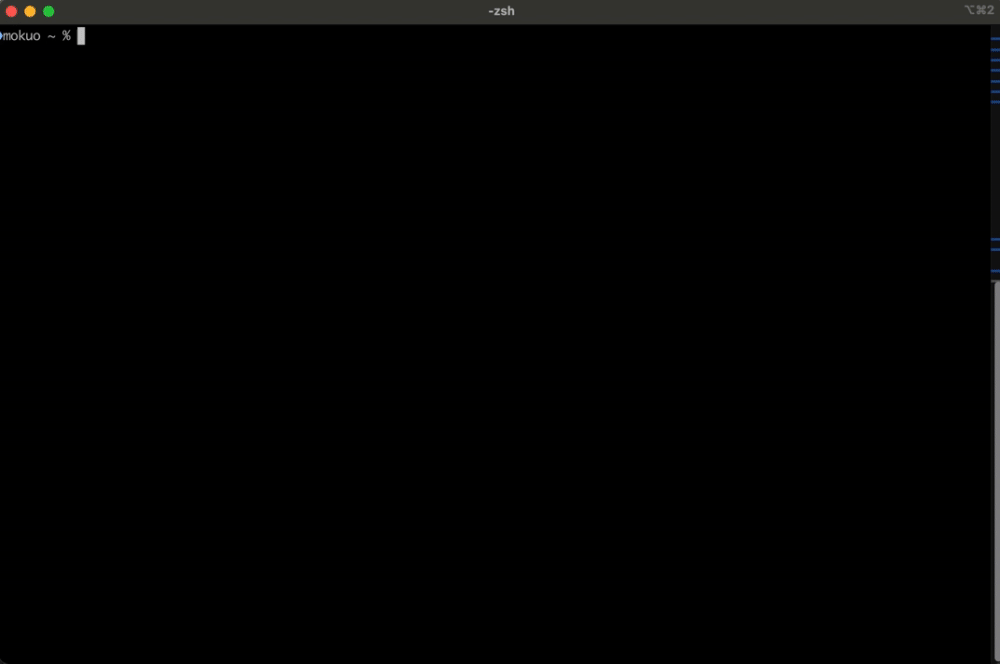

# StarWars-Terminal

StarWars terminal themes inspired at [Pokemon-Terminal](https://github.com/LazoCoder/Pokemon-Terminal).

Example:



## Installation

Install `sw` command:

```zsh
brew tap mokuo/starwars-terminal
brew install starwars-terminal
```

Get a compatible terminal emulator:

- [iTerm2 \- macOS Terminal Replacement](https://iterm2.com/)

If requested, I would like to support more terminal emulators!

## Usage

```zsh
# Change the background image to a Star Wars character (random).
sw

# You can specify the character name.
# ex) R2-D2
sw r2-d2

# List character names.
sw list
```

## Trouble shooting

### iTerm2

Please make sure you can run a script of iTerm2 Python API:

- [Python API Introduction — iTerm2 Python API 0\.26 documentation](https://iterm2.com/python-api/tutorial/index.html)

## Contributing
Pull requests are welcome. For major changes, please open an issue first to discuss what you would like to change.

Please make sure to update tests as appropriate.

## Thanks

Special thanks to [Oxygenna](https://www.oxygenna.com/) for free set of Star Wars Character Avatars!!

- [Free Set of Star Wars Avatars \- Oxygenna Web Design](https://www.oxygenna.com/news/free-set-of-star-wars-avatars)
- [Free Set of Star Wars Avatars Vol\. 2 \- Oxygenna Web Design](https://www.oxygenna.com/news/free-set-of-star-wars-avatars-vol-2)

## License
[MIT](https://choosealicense.com/licenses/mit/)
